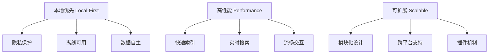
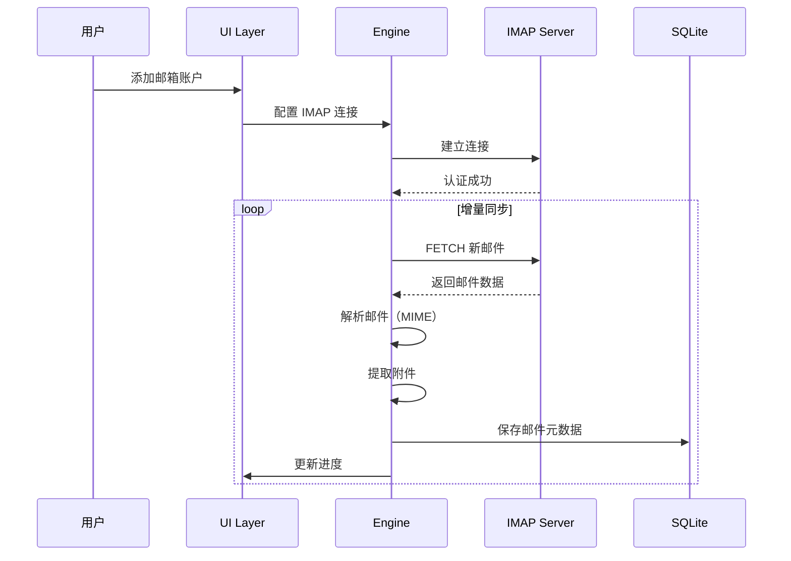
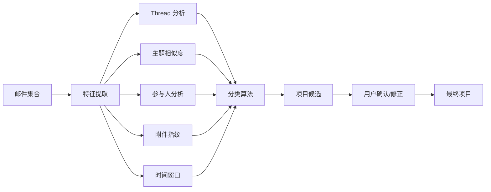
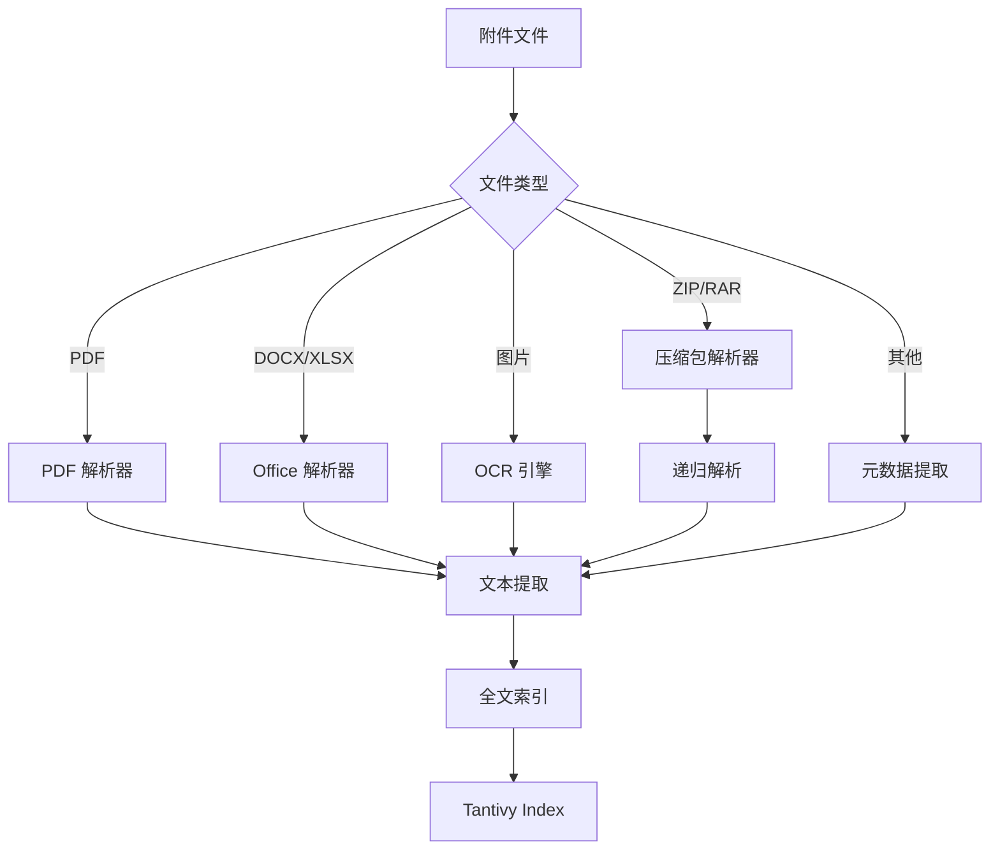
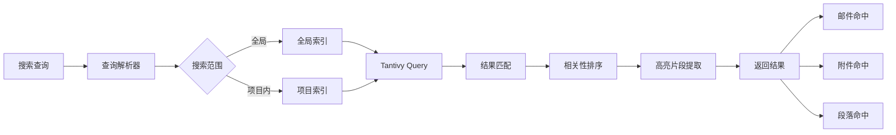
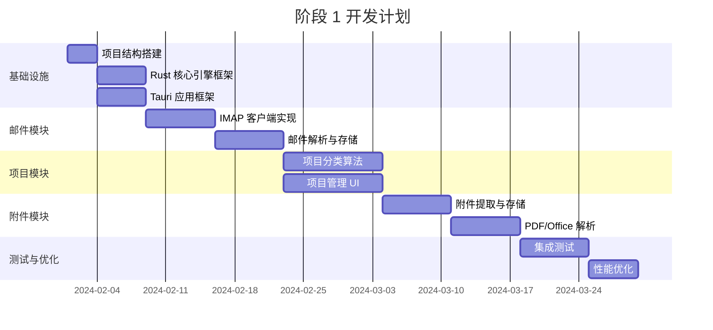
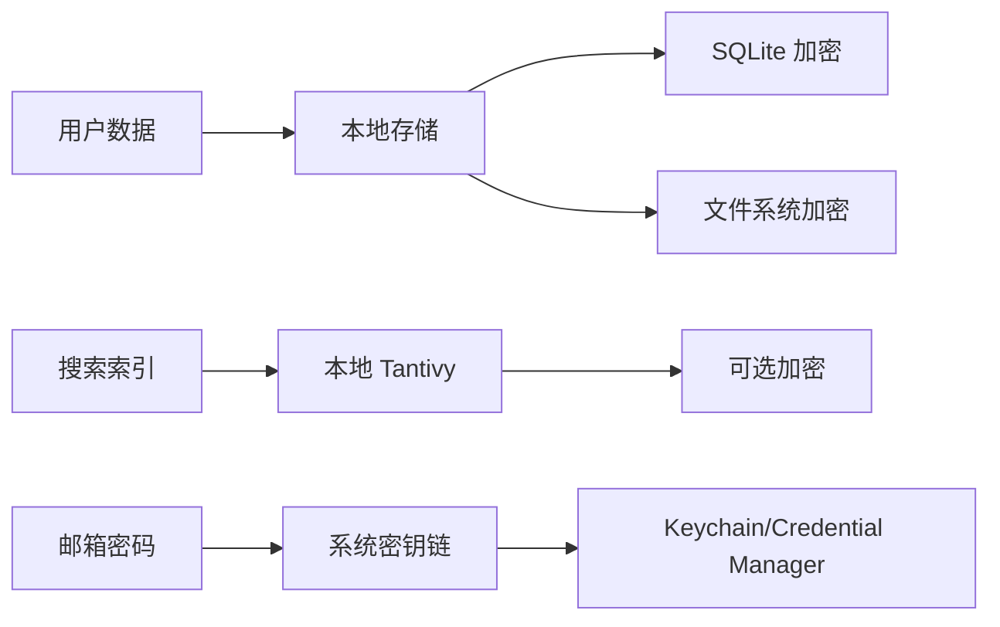

# ThreadLine 项目架构与技术路线设计

> **项目定位**：Project-centric Mail Workspace（项目型邮箱）  
> **核心理念**：将邮件与附件转化为可搜索、可理解、可管理的项目资料库

---

## 一、技术架构总览

### 1.1 架构设计原则



### 1.2 技术栈选型

#### **前端层（UI Layer）**

- **框架**: Tauri 2 + React 18
- **UI 组件库**: shadcn/ui + Radix UI
- **样式方案**: Tailwind CSS
- **状态管理**: Zustand + TanStack Query
- **路由**: React Router v6
- **图标**: Lucide React
- **Tauri API**: @tauri-apps/api（系统调用、文件操作等）

#### **核心引擎层（Core Engine）**

- **语言**: Rust
- **应用框架**: Tauri 2.0
- **全文搜索**: Tantivy（Rust 原生全文搜索引擎）
- **数据库**: SQLite（通过 rusqlite）
- **邮件协议**:
  - IMAP: async-imap
  - SMTP: lettre
- **文档解析**:
  - PDF: pdf-extract / pdfium
  - Office: docx-rs / calamine
  - OCR: tesseract-rs
- **压缩包**: zip / tar

#### **桥接层（Bridge Layer）**

- **Tauri Commands**: 前后端通信（原生集成，无需 FFI）
- **事件系统**: Tauri Event（双向通信）
- **数据序列化**: serde / serde_json
- **Tauri 插件**:
  - tauri-plugin-sql（数据库访问）
  - tauri-plugin-fs（文件系统）
  - tauri-plugin-notification（系统通知）

#### **数据存储层**

- **邮件原始数据**: 本地文件系统（mbox / eml 格式）
- **结构化数据**: SQLite
- **全文索引**: Tantivy Index Files
- **附件缓存**: 本地文件系统（分类存储）

---

## 二、项目目录结构

```
ThreadLine/
├── 📁 src-tauri/                      # Tauri 后端（Rust）
│   ├── 📁 src/
│   │   ├── main.rs                   # Tauri 应用入口
│   │   ├── lib.rs                    # 库入口
│   │   ├── 📁 commands/               # Tauri 命令（前端调用）
│   │   │   ├── mod.rs
│   │   │   ├── mail.rs               # 邮件相关命令
│   │   │   ├── project.rs            # 项目相关命令
│   │   │   ├── search.rs             # 搜索相关命令
│   │   │   └── artifact.rs           # 附件相关命令
│   │   ├── 📁 mail/                   # 邮件处理模块
│   │   │   ├── mod.rs
│   │   │   ├── imap_client.rs        # IMAP 客户端
│   │   │   ├── parser.rs             # 邮件解析
│   │   │   ├── thread.rs             # Thread 分组
│   │   │   └── sync.rs               # 同步管理
│   │   ├── 📁 project/                # 项目管理模块
│   │   │   ├── mod.rs
│   │   │   ├── classifier.rs         # 项目分类器
│   │   │   ├── merger.rs             # 项目合并
│   │   │   └── lifecycle.rs          # 生命周期管理
│   │   ├── 📁 artifacts/              # 附件处理模块
│   │   │   ├── mod.rs
│   │   │   ├── extractor.rs          # 附件提取
│   │   │   ├── parser.rs             # 文档解析
│   │   │   ├── ocr.rs                # OCR 识别
│   │   │   └── archive.rs            # 压缩包处理
│   │   ├── 📁 search/                 # 搜索引擎模块
│   │   │   ├── mod.rs
│   │   │   ├── indexer.rs            # 索引构建
│   │   │   ├── query.rs              # 查询处理
│   │   │   └── ranker.rs             # 结果排序
│   │   ├── 📁 index_scheduler/        # 索引调度器（新增）
│   │   │   ├── mod.rs
│   │   │   ├── queue.rs              # 优先级队列
│   │   │   ├── scheduler.rs          # 调度逻辑
│   │   │   ├── retry.rs              # 重试与退避
│   │   │   └── idle_detector.rs      # 空闲检测
│   │   ├── 📁 storage/                # 存储模块
│   │   │   ├── mod.rs
│   │   │   ├── database.rs           # SQLite 操作
│   │   │   ├── file_manager.rs       # 文件管理
│   │   │   └── cache.rs              # 缓存管理
│   │   └── 📁 utils/                  # 工具函数
│   │       ├── mod.rs
│   │       └── crypto.rs             # 加密工具
│   ├── Cargo.toml                    # Rust 依赖配置
│   ├── tauri.conf.json               # Tauri 配置文件
│   ├── build.rs                      # 构建脚本
│   └── 📁 icons/                      # 应用图标
│
├── 📁 src/                            # 前端（React）
│   ├── App.tsx                       # 应用根组件
│   ├── main.tsx                      # 入口文件
│   ├── 📁 pages/                      # 页面组件
│   │   ├── ProjectsPage.tsx          # 项目列表页
│   │   ├── ProjectDetailPage.tsx     # 项目详情页
│   │   ├── SearchPage.tsx            # 搜索页
│   │   └── SettingsPage.tsx          # 设置页
│   ├── 📁 components/                 # UI 组件
│   │   ├── 📁 ui/                     # 基础 UI 组件
│   │   ├── 📁 mail/                   # 邮件相关组件
│   │   ├── 📁 project/                # 项目相关组件
│   │   └── 📁 artifact/               # 附件相关组件
│   ├── 📁 hooks/                      # 自定义 Hooks
│   │   ├── useProjects.ts
│   │   ├── useSearch.ts
│   │   └── useMail.ts
│   ├── 📁 stores/                     # 状态管理
│   │   ├── projectStore.ts
│   │   ├── mailStore.ts
│   │   └── searchStore.ts
│   ├── 📁 services/                   # API 服务（调用 Tauri Commands）
│   │   ├── mailService.ts
│   │   ├── projectService.ts
│   │   ├── searchService.ts
│   │   └── artifactService.ts
│   ├── 📁 utils/                      # 工具函数
│   │   ├── format.ts
│   │   └── date.ts
│   └── 📁 styles/                     # 样式文件
│       └── globals.css
│
├── 📁 public/                         # 静态资源
│   └── favicon.ico
│
├── 📁 docs/                           # 项目文档
│   ├── architecture.md
│   ├── api-reference.md
│   ├── tauri-commands.md             # Tauri 命令文档
│   └── development-guide.md
│
├── 📁 scripts/                        # 构建脚本
│   ├── dev.sh                        # 开发环境启动
│   ├── build.sh                      # 生产构建
│   └── release.sh                    # 发布脚本
│
├── .gitignore
├── package.json
└── README.md
```

---

## 三、核心模块设计

### 3.1 邮件同步与解析模块



**关键技术点**：

- 使用 IMAP IDLE 实现实时推送
- 增量同步策略（基于 UID）
- 邮件 MIME 解析（支持多部分、嵌套附件）
- 错误重试与断点续传

---

### 3.2 项目智能分类模块



**分类策略（分阶段实现）**：

#### **MVP 阶段（Phase 1）- 强规则优先**

> ⚠️ **MVP 原则**：智能不是"自动完成"，而是"少犯错" + "易修正"

1. **基于 Thread 的聚合**（强规则，高可信度）
   - Message-ID / In-Reply-To / References 链
   - Subject 规范化相似度（去除 Re: / Fwd: / 数字后缀）
   - 同一 Thread 自动归入同一项目

2. **手动操作优先**
   - 拖拽邮件到项目
   - 合并 / 拆分项目
   - 重命名项目
   - **卖点**：分类一旦确定，就非常好用

3. **智能建议（低优先级）**
   - 仅在高置信度时提示（如 Thread + 参与人 + 时间窗口都匹配）
   - 用户可一键接受或忽略
   - 不自动执行

#### **Phase 2 阶段 - 内容智能**

4. **基于内容的聚合**（需要更多数据验证）
   - TF-IDF 主题相似度
   - 附件文件名模式匹配
   - 参与人重叠度分析

#### **Phase 3 阶段 - 学习优化**

5. **用户反馈学习**
   - 记录用户合并/拆分操作
   - 逐步优化分类参数
   - 命名实体识别（项目名、公司名）

---

### 3.3 附件深度解析模块



**解析能力**：

| 文件类型       | 解析方式             | 提取内容           |
| -------------- | -------------------- | ------------------ |
| PDF            | pdfium / pdf-extract | 文本、元数据、页数 |
| DOCX           | docx-rs              | 正文、表格、批注   |
| XLSX           | calamine             | 工作表、单元格内容 |
| 图片 (PNG/JPG) | tesseract-rs         | OCR 文字识别       |
| ZIP/RAR        | zip / unrar          | 递归解析内部文件   |
| EML            | mail-parser          | 嵌套邮件解析       |

**性能优化**：

- 异步解析队列
- 增量索引更新
- 大文件分块处理
- 解析结果缓存

**安全限制（Index Budget & Safety Limits）**：

> ⚠️ **关键**：防止用户"DoS 自己"，必须设置硬限制

| 限制项                 | 阈值       | 超出行为                 |
| ---------------------- | ---------- | ------------------------ |
| **OCR 最大页数**       | 50 页/文件 | 跳过，标记为 `skipped`   |
| **OCR 最大图片尺寸**   | 10MB/图片  | 跳过，标记为 `skipped`   |
| **OCR 触发方式**       | 手动优先   | 用户主动触发             |
| **压缩包最大深度**     | 3 层       | 停止递归                 |
| **压缩包最大文件数**   | 500 个     | 停止解压                 |
| **压缩包最大体积**     | 200MB      | 跳过，标记为 `too_large` |
| **单文件最大索引大小** | 50MB       | 仅索引前 10MB            |
| **附件总索引预算**     | 用户可配置 | 默认 5GB                 |

---

### 3.4 全文搜索引擎



**索引结构**：

```rust
// 伪代码示例
struct Document {
    id: String,
    type: DocumentType,  // Email / Attachment
    project_id: String,
    title: String,
    content: String,
    sender: String,
    recipients: Vec<String>,
    timestamp: DateTime,
    file_type: Option<String>,
    file_path: Option<String>,
}

// 索引字段
Schema {
    id: STORED,
    type: INDEXED,
    project_id: INDEXED | STORED,
    title: TEXT | STORED,
    content: TEXT,  // 全文索引
    sender: STRING | INDEXED,
    timestamp: DATE | INDEXED,
    file_type: STRING | INDEXED,
}
```

**搜索功能**：

- 全文搜索（支持中英文分词）
- 布尔查询（AND / OR / NOT）
- 短语搜索（精确匹配）
- 模糊搜索（拼写容错）
- 过滤器（时间、类型、发件人）
- 高亮显示（上下文片段）

---

### 3.6 索引调度器（Index Scheduler）

> ⭐ **专业性提升**：区分"黑盒工具"与"专业工具"的关键模块

**设计目标**：

- 后台索引不影响前台使用
- 用户可控的索引体验
- 性能平滑，避免卡顿
- 透明的索引状态

**核心功能**：

```rust
// 伪代码示例
struct IndexScheduler {
    priority_queue: PriorityQueue<IndexTask>,
    retry_policy: RetryPolicy,
    idle_detector: IdleDetector,
    pause_flag: Arc<AtomicBool>,
}

enum IndexPriority {
    Critical,   // 用户主动触发
    High,       // 最近 7 天的邮件
    Medium,     // 最近 30 天的邮件
    Low,        // 历史邮件
}

struct IndexTask {
    attachment_id: i64,
    priority: IndexPriority,
    retry_count: u32,
    created_at: DateTime,
}
```

**调度策略**：

1. **优先级队列**
   - Critical: 立即执行（用户点击"索引此文件"）
   - High: 空闲时优先处理
   - Medium/Low: 后台逐步处理

2. **空闲检测**
   - CPU 使用率 < 30%
   - 无用户交互 > 5 秒
   - 非电池模式（笔记本）

3. **重试与退避**
   - 失败任务自动重试（最多 3 次）
   - 指数退避：1s → 5s → 30s
   - 永久失败标记为 `failed`

4. **用户控制**
   - 暂停/恢复索引
   - 设置索引时间窗口（如仅在夜间）
   - 查看索引进度

---

### 3.7 索引债务（Index Debt）

> ⭐ **关键概念**：让用户清楚知道"哪些内容未索引，为什么"

**索引状态模型**：

| 状态      | 说明       | UI 展示                     |
| --------- | ---------- | --------------------------- |
| `indexed` | 已成功索引 | ✅ 已索引                   |
| `pending` | 等待索引   | ⏳ 排队中（位置: #23）      |
| `failed`  | 索引失败   | ❌ 失败（原因：文件损坏）   |
| `skipped` | 跳过索引   | ⚠️ 已跳过（原因：文件过大） |

**失败/跳过原因**：

```rust
enum IndexReason {
    TooLarge,           // 文件超过限制
    Unsupported,        // 不支持的格式
    OcrLimit,           // OCR 页数限制
    Corrupted,          // 文件损坏
    PasswordProtected,  // 密码保护
    BudgetExceeded,     // 超出索引预算
}
```

**UI 展示示例**：

```
┌─────────────────────────────────────────┐
│  索引状态                                │
├─────────────────────────────────────────┤
│  ✅ 已索引: 1,234 个附件                 │
│  ⏳ 排队中: 45 个附件                    │
│  ⚠️ 已跳过: 12 个附件                    │
│     - 文件过大: 8 个                     │
│     - OCR 限制: 3 个                     │
│     - 不支持格式: 1 个                   │
│  ❌ 失败: 2 个附件                       │
│                                          │
│  [查看详情] [重试失败项] [暂停索引]      │
└─────────────────────────────────────────┘
```

**数据可重建声明**：

> ⚠️ **重要承诺**：降低用户焦虑，增强信任

- **Tantivy 索引可随时删除重建**
- **SQLite 是唯一的 source of truth**
- **删除索引 ≠ 删除邮件/附件**
- **用户可随时"重建全部索引"**

---

### 3.8 数据存储设计

#### **SQLite 数据库表结构**

```sql
-- 邮箱账户表
CREATE TABLE accounts (
    id INTEGER PRIMARY KEY,
    email TEXT UNIQUE NOT NULL,
    provider TEXT,  -- gmail / outlook / custom
    imap_config TEXT,  -- JSON
    created_at DATETIME DEFAULT CURRENT_TIMESTAMP
);

-- 邮件表
CREATE TABLE emails (
    id INTEGER PRIMARY KEY,
    message_id TEXT UNIQUE NOT NULL,
    account_id INTEGER,
    thread_id TEXT,
    project_id INTEGER,
    subject TEXT,
    sender TEXT,
    recipients TEXT,  -- JSON array
    date DATETIME,
    body_text TEXT,
    body_html TEXT,
    has_attachments BOOLEAN,
    is_read BOOLEAN DEFAULT 0,
    is_starred BOOLEAN DEFAULT 0,
    raw_path TEXT,  -- 原始 .eml 文件路径
    created_at DATETIME DEFAULT CURRENT_TIMESTAMP,
    FOREIGN KEY (account_id) REFERENCES accounts(id),
    FOREIGN KEY (project_id) REFERENCES projects(id)
);

-- 项目表
CREATE TABLE projects (
    id INTEGER PRIMARY KEY,
    name TEXT NOT NULL,
    description TEXT,
    status TEXT DEFAULT 'active',  -- active / archived
    color TEXT,
    is_pinned BOOLEAN DEFAULT 0,
    email_count INTEGER DEFAULT 0,
    attachment_count INTEGER DEFAULT 0,
    created_at DATETIME DEFAULT CURRENT_TIMESTAMP,
    updated_at DATETIME DEFAULT CURRENT_TIMESTAMP
);

-- 附件表
CREATE TABLE attachments (
    id INTEGER PRIMARY KEY,
    email_id INTEGER,
    project_id INTEGER,
    filename TEXT NOT NULL,
    file_type TEXT,
    file_size INTEGER,
    mime_type TEXT,
    file_path TEXT,  -- 本地存储路径
    content_hash TEXT,  -- SHA256

    -- ⚠️ 修正：不在 SQLite 中存储大文本，改为路径引用
    parsed_content_path TEXT,  -- 解析后的文本文件路径
    ocr_content_path TEXT,     -- OCR 识别文本文件路径

    -- 索引状态管理（Index Debt）
    index_status TEXT DEFAULT 'pending',  -- indexed / pending / failed / skipped
    index_reason TEXT,  -- 失败/跳过原因：too_large / unsupported / ocr_limit
    indexed_at DATETIME,  -- 索引时间

    status TEXT,  -- draft / final / signed
    created_at DATETIME DEFAULT CURRENT_TIMESTAMP,
    FOREIGN KEY (email_id) REFERENCES emails(id),
    FOREIGN KEY (project_id) REFERENCES projects(id)
);

-- 项目里程碑表
CREATE TABLE milestones (
    id INTEGER PRIMARY KEY,
    project_id INTEGER,
    email_id INTEGER,
    type TEXT,  -- approved / signed / paid / completed
    title TEXT,
    date DATETIME,
    FOREIGN KEY (project_id) REFERENCES projects(id),
    FOREIGN KEY (email_id) REFERENCES emails(id)
);

-- 搜索历史表
CREATE TABLE search_history (
    id INTEGER PRIMARY KEY,
    query TEXT NOT NULL,
    filters TEXT,  -- JSON
    result_count INTEGER,
    searched_at DATETIME DEFAULT CURRENT_TIMESTAMP
);

-- 索引
CREATE INDEX idx_emails_project ON emails(project_id);
CREATE INDEX idx_emails_thread ON emails(thread_id);
CREATE INDEX idx_emails_date ON emails(date DESC);
CREATE INDEX idx_attachments_project ON attachments(project_id);
CREATE INDEX idx_attachments_type ON attachments(file_type);
```

#### **文件系统组织**

```
~/.threadline/
├── 📁 data/
│   ├── threadline.db              # SQLite 数据库
│   └── search.index/              # Tantivy 索引文件
│       ├── meta.json
│       └── segments/
│
├── 📁 mail/
│   ├── 📁 account_1/              # 按账户分类
│   │   ├── 📁 inbox/
│   │   │   ├── 2024-01.mbox
│   │   │   └── 2024-02.mbox
│   │   └── 📁 sent/
│   │
│   └── 📁 account_2/
│
├── 📁 attachments/
│   ├── 📁 pdf/
│   │   └── a3f2e1d9.../contract.pdf
│   ├── 📁 docx/
│   ├── 📁 xlsx/
│   └── 📁 images/
│
├── 📁 cache/
│   ├── 📁 thumbnails/             # 附件缩略图
│   ├── 📁 parsed/                 # 解析后的文本文件
│   │   ├── 📁 pdf/
│   │   ├── 📁 docx/
│   │   └── 📁 xlsx/
│   └── 📁 ocr/                    # OCR 识别结果
│       └── 📁 images/
│
└── config.json                    # 应用配置
```

---

## 四、Tauri Commands API 设计

### 4.1 前后端通信接口

Tauri Commands 是前端（React）调用后端（Rust）的桥梁，所有接口均通过 `invoke()` 调用。

#### **项目管理 API**

```rust
// 获取所有项目列表
#[tauri::command]
async fn list_projects() -> Result<Vec<Project>, String>

// 获取项目详情
#[tauri::command]
async fn get_project(project_id: i64) -> Result<ProjectDetail, String>

// 创建新项目
#[tauri::command]
async fn create_project(name: String, description: Option<String>) -> Result<Project, String>

// 更新项目信息
#[tauri::command]
async fn update_project(project_id: i64, updates: ProjectUpdate) -> Result<(), String>

// 删除项目
#[tauri::command]
async fn delete_project(project_id: i64) -> Result<(), String>

// 合并项目
#[tauri::command]
async fn merge_projects(source_ids: Vec<i64>, target_id: i64) -> Result<(), String>

// 置顶/取消置顶项目
#[tauri::command]
async fn toggle_pin_project(project_id: i64) -> Result<(), String>

// 归档/取消归档项目
#[tauri::command]
async fn toggle_archive_project(project_id: i64) -> Result<(), String>
```

#### **邮件管理 API**

```rust
// 同步邮件（增量）
#[tauri::command]
async fn sync_emails(account_id: i64) -> Result<SyncProgress, String>

// 获取项目的邮件列表
#[tauri::command]
async fn list_emails(project_id: i64, filters: EmailFilters) -> Result<Vec<Email>, String>

// 获取邮件详情
#[tauri::command]
async fn get_email(email_id: i64) -> Result<EmailDetail, String>

// 移动邮件到项目
#[tauri::command]
async fn move_email_to_project(email_id: i64, project_id: i64) -> Result<(), String>

// 标记邮件为已读/未读
#[tauri::command]
async fn mark_email_read(email_id: i64, is_read: bool) -> Result<(), String>

// 标记邮件为星标
#[tauri::command]
async fn toggle_star_email(email_id: i64) -> Result<(), String>
```

#### **附件管理 API**

```rust
// 获取项目的附件列表
#[tauri::command]
async fn list_attachments(project_id: i64, filters: AttachmentFilters) -> Result<Vec<Attachment>, String>

// 获取附件详情
#[tauri::command]
async fn get_attachment(attachment_id: i64) -> Result<AttachmentDetail, String>

// 触发附件索引（手动）
#[tauri::command]
async fn index_attachment(attachment_id: i64) -> Result<(), String>

// 获取附件解析内容
#[tauri::command]
async fn get_parsed_content(attachment_id: i64) -> Result<String, String>

// 下载附件到指定位置
#[tauri::command]
async fn export_attachment(attachment_id: i64, dest_path: String) -> Result<(), String>

// 批量导出附件
#[tauri::command]
async fn export_attachments(attachment_ids: Vec<i64>, dest_dir: String) -> Result<(), String>
```

#### **搜索 API**

```rust
// 全局搜索
#[tauri::command]
async fn search_global(query: String, filters: SearchFilters) -> Result<SearchResults, String>

// 项目内搜索
#[tauri::command]
async fn search_in_project(project_id: i64, query: String) -> Result<SearchResults, String>

// 获取搜索建议（自动补全）
#[tauri::command]
async fn get_search_suggestions(partial_query: String) -> Result<Vec<String>, String>

// 获取搜索历史
#[tauri::command]
async fn get_search_history(limit: usize) -> Result<Vec<SearchHistoryItem>, String>
```

#### **索引管理 API**

```rust
// 获取索引状态
#[tauri::command]
async fn get_index_status() -> Result<IndexStatus, String>

// 暂停/恢复索引
#[tauri::command]
async fn toggle_indexing(pause: bool) -> Result<(), String>

// 重建全部索引
#[tauri::command]
async fn rebuild_index() -> Result<(), String>

// 获取索引队列
#[tauri::command]
async fn get_index_queue() -> Result<Vec<IndexTask>, String>

// 重试失败的索引任务
#[tauri::command]
async fn retry_failed_index_tasks() -> Result<(), String>
```

#### **账户管理 API**

```rust
// 添加邮箱账户
#[tauri::command]
async fn add_account(config: AccountConfig) -> Result<Account, String>

// 获取所有账户
#[tauri::command]
async fn list_accounts() -> Result<Vec<Account>, String>

// 删除账户
#[tauri::command]
async fn delete_account(account_id: i64) -> Result<(), String>

// 测试账户连接
#[tauri::command]
async fn test_account_connection(config: AccountConfig) -> Result<bool, String>
```

#### **数据类型定义**

```rust
#[derive(Serialize, Deserialize)]
struct Project {
    id: i64,
    title: String,
    description: Option<String>,
    status: String,
    is_pinned: bool,
    last_updated: String,
    stats: ProjectStats,
    tags: Option<Vec<String>>,
    last_activity: Option<LastActivity>,
    participants: Option<Vec<String>>,
}

#[derive(Serialize, Deserialize)]
struct ProjectStats {
    emails: i32,
    attachments: i32,
}

#[derive(Serialize, Deserialize)]
struct SearchResults {
    total: usize,
    results: Vec<SearchResult>,
    took_ms: u64,
}

#[derive(Serialize, Deserialize)]
struct IndexStatus {
    indexed_count: i64,
    pending_count: i64,
    failed_count: i64,
    skipped_count: i64,
    is_paused: bool,
    current_task: Option<String>,
}
```

### 4.2 事件系统（Event Emitter）

后端主动向前端推送事件，用于实时更新 UI。

```rust
// 邮件同步进度事件
emit("sync-progress", {
    account_id: 1,
    current: 150,
    total: 500,
    status: "syncing"
})

// 索引进度事件
emit("index-progress", {
    indexed: 1234,
    pending: 45,
    current_file: "contract.pdf"
})

// 新邮件到达事件
emit("new-email", {
    email_id: 12345,
    project_id: 5,
    subject: "合同已签署"
})

// 错误事件
emit("error", {
    type: "sync_failed",
    message: "无法连接到邮件服务器",
    account_id: 1
})
```

### 4.3 错误处理规范

所有 Tauri Commands 返回 `Result<T, String>`，错误信息格式：

```json
{
  "code": "PROJECT_NOT_FOUND",
  "message": "项目不存在",
  "details": {
    "project_id": 123
  }
}
```

**错误代码分类**：

| 错误类型     | 代码前缀 | 示例                   |
| ------------ | -------- | ---------------------- |
| 数据库错误   | `DB_`    | `DB_CONNECTION_FAILED` |
| 网络错误     | `NET_`   | `NET_IMAP_AUTH_FAILED` |
| 文件系统错误 | `FS_`    | `FS_DISK_FULL`         |
| 索引错误     | `IDX_`   | `IDX_CORRUPTED`        |
| 验证错误     | `VAL_`   | `VAL_INVALID_EMAIL`    |

---

## 五、主要界面设计思路

### 5.1 整体布局架构

```
┌─────────────────────────────────────────────────────────────┐
│  ThreadLine                                    [- □ ×]      │
├──────────┬──────────────────────────────────────────────────┤
│          │  🔍 Search: "合同 final version"                 │
│  侧边栏   ├──────────────────────────────────────────────────┤
│          │                                                  │
│  📊 项目  │                                                  │
│  📁 附件  │              主内容区域                           │
│  🔍 搜索  │                                                  │
│  ⚙️ 设置  │                                                  │
│          │                                                  │
│          │                                                  │
└──────────┴──────────────────────────────────────────────────┘
```

---

### 5.2 核心界面设计

#### **界面 1：项目列表视图（Projects View）**

**设计目标**：让用户快速浏览所有项目，一眼看清项目状态

```
┌─────────────────────────────────────────────────────────────┐
│  Projects                                    [+ 新建项目]    │
├─────────────────────────────────────────────────────────────┤
│  📌 已置顶                                                   │
│  ┌───────────────────────────────────────────────────────┐  │
│  │ 🔵 客户 A - 2024 年度合作协议                          │  │
│  │ 最后更新: 2 小时前  ·  12 封邮件  ·  8 个附件          │  │
│  │ 📎 合同_final_v3.pdf  📎 报价单.xlsx                   │  │
│  └───────────────────────────────────────────────────────┘  │
│                                                              │
│  🟢 进行中                                                   │
│  ┌───────────────────────────────────────────────────────┐  │
│  │ 🟢 产品 X 技术对接                                     │  │
│  │ 最后更新: 昨天  ·  23 封邮件  ·  15 个附件             │  │
│  └───────────────────────────────────────────────────────┘  │
│  ┌───────────────────────────────────────────────────────┐  │
│  │ 🟡 供应商 B 询价流程                                   │  │
│  │ 最后更新: 3 天前  ·  8 封邮件  ·  3 个附件             │  │
│  └───────────────────────────────────────────────────────┘  │
│                                                              │
│  📦 已归档  (45)                                [展开 ▼]     │
└─────────────────────────────────────────────────────────────┘
```

**关键元素**：

- 项目状态标识（颜色编码）
- 置顶功能
- 快速统计（邮件数、附件数）
- 最新附件预览
- 分组折叠（进行中/已归档）

---

#### **界面 2：项目详情 - 时间线视图（Project Timeline）**

**设计目标**：清晰展示项目演进过程，快速定位关键节点

```
┌─────────────────────────────────────────────────────────────┐
│  ← 返回项目列表    客户 A - 2024 年度合作协议                │
├─────────────────────────────────────────────────────────────┤
│  [时间线] [附件库] [搜索]                                    │
├─────────────────────────────────────────────────────────────┤
│                                                              │
│  ⭐ 里程碑: 合同已签署                        2024-01-15    │
│  ├─ 📧 张三 → 我                                            │
│  │   "合同已双方签署完成，附件为扫描件"                      │
│  │   📎 合同_signed.pdf  [预览]                             │
│  │                                                          │
│  │  💬 Thread (3 封)                            [展开 ▼]    │
│  │                                                          │
│  ├─ 📧 我 → 张三                                2024-01-10  │
│  │   "请查收修改后的合同版本"                                │
│  │   📎 合同_v3_final.pdf                                   │
│  │                                                          │
│  ├─ 📧 李四 → 全部                              2024-01-08  │
│  │   "法务审核意见"                                          │
│  │   📎 审核意见.docx                                       │
│  │                                                          │
│  │  💬 Thread (5 封)                            [展开 ▼]    │
│  │                                                          │
│  ⭐ 里程碑: 初稿提交                          2024-01-02    │
│  ├─ 📧 张三 → 我                                            │
│      "合同初稿请查收"                                        │
│      📎 合同_draft_v1.pdf                                   │
│                                                              │
└─────────────────────────────────────────────────────────────┘
```

**关键元素**：

- 里程碑自动识别（Signed / Approved / Final）
- Thread 折叠/展开
- 附件内联预览
- 时间轴可视化
- 快速跳转功能

---

#### **界面 3：附件库视图（Artifacts Library）**

**设计目标**：将附件作为一等公民，独立于邮件进行管理

```
┌─────────────────────────────────────────────────────────────┐
│  ← 返回项目列表    客户 A - 2024 年度合作协议                │
├─────────────────────────────────────────────────────────────┤
│  [时间线] [附件库] [搜索]                                    │
├─────────────────────────────────────────────────────────────┤
│  过滤: [全部 ▼] [PDF] [DOCX] [XLSX] [图片]                  │
│  排序: [时间 ▼] [名称] [大小] [类型]                         │
├─────────────────────────────────────────────────────────────┤
│                                                              │
│  📄 PDF 文档 (5)                                             │
│  ┌──────────────────────────────────────────────────────┐   │
│  │ 📕 合同_signed.pdf                    ⭐ Final        │   │
│  │ 2.3 MB  ·  15 页  ·  2024-01-15                      │   │
│  │ 来自: 张三 <zhang@example.com>                       │   │
│  │ [预览] [下载] [在邮件中查看]                          │   │
│  └──────────────────────────────────────────────────────┘   │
│  ┌──────────────────────────────────────────────────────┐   │
│  │ 📕 合同_v3_final.pdf                  🟡 Draft        │   │
│  │ 2.1 MB  ·  15 页  ·  2024-01-10                      │   │
│  │ 来自: 我                                              │   │
│  │ [预览] [下载] [在邮件中查看]                          │   │
│  └──────────────────────────────────────────────────────┘   │
│                                                              │
│  📝 Word 文档 (2)                                            │
│  ┌──────────────────────────────────────────────────────┐   │
│  │ 📘 审核意见.docx                                      │   │
│  │ 156 KB  ·  3 页  ·  2024-01-08                       │   │
│  │ 来自: 李四 <li@example.com>                          │   │
│  │ [预览] [下载] [在邮件中查看]                          │   │
│  └──────────────────────────────────────────────────────┘   │
│                                                              │
└─────────────────────────────────────────────────────────────┘
```

**关键元素**：

- 文件类型分组
- 状态标签（Draft / Final / Signed）
- 文件元数据（大小、页数、日期）
- 来源邮件快速跳转
- 内联预览功能

---

#### **界面 4：全局搜索界面（Search View）**

**设计目标**：提供"信息级"搜索结果，而非"邮件级"

```
┌─────────────────────────────────────────────────────────────┐
│  🔍 搜索: "付款条款 30天"                                    │
│  过滤: [所有项目 ▼] [所有类型 ▼] [所有时间 ▼]               │
├─────────────────────────────────────────────────────────────┤
│  找到 8 个结果                                               │
│                                                              │
│  📁 客户 A - 2024 年度合作协议                               │
│  ┌──────────────────────────────────────────────────────┐   │
│  │ 📕 合同_signed.pdf  (第 7 页)                         │   │
│  │ ...乙方应在收到发票后 **30天** 内完成**付款**。       │   │
│  │ **付款条款** 详见附件 A...                            │   │
│  │ 2024-01-15  ·  来自: 张三                             │   │
│  │ [在文件中查看] [在项目中查看]                         │   │
│  └──────────────────────────────────────────────────────┘   │
│                                                              │
│  ┌──────────────────────────────────────────────────────┐   │
│  │ 📧 邮件: "关于付款条款的确认"                         │   │
│  │ ...我们同意将**付款条款**修改为 **30天** 账期...      │   │
│  │ 2024-01-12  ·  发件人: 李四                           │   │
│  │ [查看邮件] [在项目中查看]                             │   │
│  └──────────────────────────────────────────────────────┘   │
│                                                              │
│  📁 供应商 B 询价流程                                        │
│  ┌──────────────────────────────────────────────────────┐   │
│  │ 📗 报价单.xlsx  (Sheet1, A15)                         │   │
│  │ **付款条款**: 发货后 **30天** 内付款                  │   │
│  │ 2024-01-20  ·  来自: 王五                             │   │
│  │ [在文件中查看] [在项目中查看]                         │   │
│  └──────────────────────────────────────────────────────┘   │
│                                                              │
└─────────────────────────────────────────────────────────────┘
```

**关键元素**：

- 关键词高亮
- 上下文片段展示
- 精确定位（文件页码、Excel 单元格）
- 多维度过滤
- 项目分组展示
- 快速跳转到原文

---

#### **界面 5：附件预览面板（Attachment Preview）**

**设计目标**：无需下载即可快速浏览附件内容

```
┌─────────────────────────────────────────────────────────────┐
│  合同_signed.pdf                                    [× 关闭] │
├─────────────────────────────────────────────────────────────┤
│  [◀ 上一个]  第 7 / 15 页  [下一个 ▶]      [🔍 搜索] [下载] │
├─────────────────────────────────────────────────────────────┤
│                                                              │
│         ┌─────────────────────────────────────┐             │
│         │                                     │             │
│         │      [PDF 渲染内容]                 │             │
│         │                                     │             │
│         │  第七条 付款条款                     │             │
│         │                                     │             │
│         │  乙方应在收到发票后 30天 内         │             │
│         │  完成付款...                        │             │
│         │                                     │             │
│         │                                     │             │
│         └─────────────────────────────────────┘             │
│                                                              │
├─────────────────────────────────────────────────────────────┤
│  📧 来自邮件: "合同已双方签署完成"                           │
│  📅 2024-01-15  ·  发件人: 张三 <zhang@example.com>         │
│  📁 项目: 客户 A - 2024 年度合作协议                         │
│  [在邮件中查看] [在项目中查看]                               │
└─────────────────────────────────────────────────────────────┘
```

**关键元素**：

- 内置 PDF/Office 渲染器
- 页面导航
- 文件内搜索
- 来源信息展示
- 快速跳转链接

---

### 5.3 交互设计亮点

#### **1. 智能项目建议**

```
┌─────────────────────────────────────────────┐
│  💡 发现 5 封邮件可能属于同一项目            │
│  ┌─────────────────────────────────────┐   │
│  │ 建议项目名: "客户 C - Q1 营销方案"   │   │
│  │ 包含邮件: 5 封                       │   │
│  │ 附件: 3 个                           │   │
│  │ [创建项目] [忽略] [查看详情]         │   │
│  └─────────────────────────────────────┘   │
└─────────────────────────────────────────────┘
```

#### **2. 附件版本对比**

```
┌─────────────────────────────────────────────┐
│  检测到同名文件的多个版本                    │
│  ┌─────────────────────────────────────┐   │
│  │ 📕 合同_v1.pdf  (2024-01-02)         │   │
│  │ 📕 合同_v2.pdf  (2024-01-08)         │   │
│  │ 📕 合同_v3_final.pdf  (2024-01-10)   │   │
│  │ 📕 合同_signed.pdf  (2024-01-15) ⭐  │   │
│  │ [对比版本] [标记最终版]              │   │
│  └─────────────────────────────────────┘   │
└─────────────────────────────────────────────┘
```

#### **3. 快捷键支持**

- `Cmd/Ctrl + K`: 全局搜索
- `Cmd/Ctrl + P`: 快速切换项目
- `Cmd/Ctrl + F`: 当前页面搜索
- `Space`: 快速预览附件
- `Esc`: 关闭预览/对话框

---

## 六、错误处理与容错设计

### 6.1 错误处理策略

#### **网络错误处理**

| 错误场景       | 处理策略                               | 用户体验                             |
| -------------- | -------------------------------------- | ------------------------------------ |
| IMAP 连接失败  | 自动重试 3 次（指数退避：1s, 5s, 15s） | 显示重试进度，提供"手动重试"按钮     |
| 认证失败       | 立即停止，不重试                       | 提示用户检查密码，引导重新配置       |
| 网络超时       | 保存断点，下次继续                     | 显示"已暂停，将在网络恢复后继续"     |
| 邮件服务器维护 | 延迟 1 小时后重试                      | 显示"服务器暂时不可用，稍后自动重试" |

#### **文件系统错误处理**

| 错误场景            | 处理策略                   | 用户体验                               |
| ------------------- | -------------------------- | -------------------------------------- |
| 磁盘空间不足        | 暂停所有下载和索引         | 显示警告："磁盘空间不足，请清理后继续" |
| 文件权限错误        | 记录错误日志，跳过该文件   | 显示："部分文件无法访问，已跳过"       |
| 文件损坏            | 标记为 `corrupted`，不重试 | 在附件列表中显示"文件已损坏"标记       |
| 路径过长（Windows） | 使用短路径或哈希命名       | 透明处理，用户无感知                   |

#### **数据库错误处理**

| 错误场景     | 处理策略                         | 用户体验                          |
| ------------ | -------------------------------- | --------------------------------- |
| 数据库锁定   | 等待最多 5 秒，超时则提示        | 显示"数据库繁忙，请稍候"          |
| 数据库损坏   | 尝试自动修复，失败则提示备份恢复 | 显示"数据库异常，正在尝试修复..." |
| 磁盘写入失败 | 回滚事务，保持数据一致性         | 显示"操作失败，数据未改变"        |

#### **索引错误处理**

| 错误场景 | 处理策略                       | 用户体验                     |
| -------- | ------------------------------ | ---------------------------- |
| 索引损坏 | 提供"重建索引"选项             | 显示"索引异常，建议重建索引" |
| 解析失败 | 标记为 `failed`，记录原因      | 在附件详情中显示失败原因     |
| OCR 超时 | 标记为 `skipped`，允许手动重试 | 显示"OCR 超时，点击重试"     |

### 6.2 日志系统设计

#### **日志级别**

```rust
enum LogLevel {
    Error,   // 严重错误，影响核心功能
    Warn,    // 警告，功能降级但可继续
    Info,    // 重要信息，如同步完成
    Debug,   // 调试信息，仅开发模式
    Trace,   // 详细追踪，性能分析
}
```

#### **日志存储**

```
~/.threadline/logs/
├── app.log              # 应用主日志（滚动，最多 10MB）
├── sync.log             # 邮件同步日志
├── index.log            # 索引日志
└── error.log            # 错误日志（永久保留）
```

#### **日志内容示例**

```
[2024-01-15 14:23:45] [INFO] [sync] Started syncing account: user@example.com
[2024-01-15 14:23:46] [DEBUG] [sync] Fetched 150 new emails
[2024-01-15 14:23:50] [WARN] [parser] Failed to parse attachment: corrupted_file.pdf (reason: invalid PDF header)
[2024-01-15 14:24:00] [ERROR] [imap] Connection lost: timeout after 30s
[2024-01-15 14:24:05] [INFO] [sync] Sync completed: 150 emails, 45 attachments
```

### 6.3 崩溃恢复机制

#### **应用崩溃恢复**

1. **自动保存状态**
   - 每 30 秒保存当前同步进度
   - 保存未完成的索引队列
   - 保存用户未保存的操作（如正在编辑的项目名称）

2. **重启后恢复**
   - 检测上次是否异常退出
   - 提示用户："检测到上次异常退出，是否继续未完成的任务？"
   - 恢复同步进度和索引队列

3. **数据完整性检查**
   - 启动时检查数据库完整性
   - 检查索引文件是否损坏
   - 发现问题时提供修复选项

#### **数据备份与恢复**

```rust
// 自动备份策略
struct BackupPolicy {
    auto_backup: bool,           // 是否自动备份
    backup_interval: Duration,   // 备份间隔（默认每天）
    max_backups: usize,          // 最多保留备份数（默认 7 个）
    backup_location: PathBuf,    // 备份位置
}
```

**备份内容**：

- SQLite 数据库文件
- 配置文件
- 索引文件（可选，因为可重建）

**恢复流程**：

1. 用户选择备份文件
2. 验证备份完整性
3. 停止所有后台任务
4. 替换数据库文件
5. 重启应用

### 6.4 优雅降级策略

当某些功能不可用时，应用仍能正常使用核心功能：

| 功能不可用       | 降级方案                           |
| ---------------- | ---------------------------------- |
| 全文搜索索引损坏 | 降级为数据库 LIKE 查询（慢但可用） |
| OCR 引擎不可用   | 跳过图片识别，仅索引文本附件       |
| 网络断开         | 离线模式，仅查看已同步内容         |
| 磁盘空间不足     | 停止下载，允许查看和搜索现有内容   |

---

## 七、测试策略

### 7.1 单元测试

**目标覆盖率**：核心模块 > 80%

**重点测试模块**：

- 邮件解析器（MIME 解析、附件提取）
- 项目分类算法
- 搜索查询解析
- 文件解析器（PDF、Office、OCR）

```rust
#[cfg(test)]
mod tests {
    use super::*;

    #[test]
    fn test_email_parser() {
        let raw_email = include_str!("../fixtures/sample_email.eml");
        let parsed = parse_email(raw_email).unwrap();
        assert_eq!(parsed.subject, "Test Subject");
        assert_eq!(parsed.attachments.len(), 2);
    }

    #[test]
    fn test_project_classifier() {
        let emails = vec![/* ... */];
        let projects = classify_into_projects(emails);
        assert_eq!(projects.len(), 3);
    }
}
```

### 7.2 集成测试

**测试场景**：

1. **完整同步流程**
   - 连接 IMAP 服务器
   - 同步邮件
   - 解析附件
   - 构建索引
   - 执行搜索

2. **项目管理流程**
   - 创建项目
   - 移动邮件到项目
   - 合并项目
   - 归档项目

3. **错误恢复流程**
   - 模拟网络中断
   - 模拟磁盘满
   - 模拟数据库损坏

### 7.3 性能测试

**基准测试**：

```rust
#[bench]
fn bench_search_10k_emails(b: &mut Bencher) {
    let index = setup_test_index(10_000);
    b.iter(|| {
        index.search("合同").unwrap();
    });
}

#[bench]
fn bench_pdf_parsing(b: &mut Bencher) {
    let pdf_data = include_bytes!("../fixtures/sample.pdf");
    b.iter(|| {
        parse_pdf(pdf_data).unwrap();
    });
}
```

**性能目标验证**：

- 搜索 10 万封邮件 < 200ms
- 解析 100 页 PDF < 10s
- 同步 1000 封邮件 < 10s

### 7.4 端到端测试

使用 Tauri 的测试框架进行 UI 自动化测试：

```typescript
// 示例：测试项目创建流程
test("create new project", async () => {
  await app.click('[data-testid="new-project-btn"]');
  await app.fill('[data-testid="project-name"]', "Test Project");
  await app.click('[data-testid="create-btn"]');

  const projectList = await app.$$('[data-testid="project-card"]');
  expect(projectList.length).toBeGreaterThan(0);
});
```

### 7.5 跨平台测试

**测试矩阵**：

| 平台          | 版本                | 测试重点                 |
| ------------- | ------------------- | ------------------------ |
| Windows 10/11 | x64                 | 文件路径、权限、中文路径 |
| macOS 12+     | Intel/Apple Silicon | 文件系统、权限、公证     |
| Linux         | Ubuntu 22.04        | 依赖库、文件系统         |

**CI/CD 流程**：

- 每次提交自动运行单元测试
- PR 合并前运行集成测试
- 发布前在三个平台上运行完整测试

---

## 八、技术实现路线图

### 8.1 阶段 1：核心基础（MVP）- 8 周

**目标**：实现基本的邮件同步、项目分类、附件管理



**交付物**：

- ✅ 支持 IMAP 邮箱同步
- ✅ 基础项目自动分类
- ✅ 附件提取与 PDF/Office 解析
- ✅ 简单的项目列表与时间线视图

---

### 8.2 阶段 2：搜索与智能化（增强）- 6 周

**目标**：实现全文搜索、OCR、智能分类优化

**关键功能**：

- ✅ Tantivy 全文搜索引擎集成
- ✅ OCR 图片文字识别
- ✅ 压缩包递归解析
- ✅ 搜索结果高亮与片段提取
- ✅ 项目分类模型优化

---

### 8.3 阶段 3：用户体验优化（打磨）- 4 周

**目标**：完善 UI/UX，提升性能与稳定性

**关键改进**：

- ✅ 附件预览面板
- ✅ 版本对比功能
- ✅ 快捷键系统
- ✅ 增量同步优化
- ✅ 错误处理与日志系统

---

### 8.4 阶段 4：高级功能（扩展）- 6 周

**目标**：里程碑识别、智能建议、导出功能

**关键功能**：

- ✅ 里程碑自动识别
- ✅ 项目智能建议
- ✅ 附件版本管理
- ✅ 项目导出（PDF 报告）
- ✅ 数据备份与恢复

---

## 九、关键技术挑战与解决方案

### 9.1 挑战：大量邮件的索引性能

**问题**：用户可能有数万封邮件，全量索引耗时长

**解决方案**：

1. **增量索引**：只索引新邮件和变更邮件
2. **异步处理**：后台队列处理，不阻塞 UI
3. **优先级策略**：
   - 高优先级：最近 3 个月邮件
   - 中优先级：3-12 个月邮件
   - 低优先级：历史邮件
4. **分片索引**：按时间分片，加速查询

---

### 9.2 挑战：附件解析的准确性

**问题**：复杂 PDF、扫描件、加密文档解析困难

**解决方案**：

1. **多引擎备选**：
   - 主引擎：pdfium
   - 备选引擎：pdf-extract
   - OCR 兜底：tesseract
2. **解析质量检测**：
   - 检测提取文本的完整性
   - 低质量时自动切换引擎
3. **用户反馈**：
   - 允许用户标记解析错误
   - 手动上传正确文本

---

### 9.3 挑战：项目分类的准确性

**问题**：自动分类可能出错，用户需要频繁修正

**解决方案**：

1. **保守策略**：
   - 只在高置信度时自动创建项目
   - 低置信度时提供建议，由用户确认
2. **学习机制**：
   - 记录用户的合并/拆分操作
   - 逐步优化分类参数
3. **手动优先**：
   - 提供便捷的手动管理工具
   - 支持拖拽、批量操作

---

### 9.4 挑战：跨平台一致性

**问题**：Windows / macOS 文件系统、路径差异

**解决方案**：

1. **统一路径处理**：使用 Rust 的 `std::path::PathBuf`
2. **平台特定代码隔离**：条件编译
3. **充分测试**：在两个平台上持续测试

---

## 十、隐私与安全设计

### 10.1 数据隐私保护



**关键措施**：

1. **数据不出本地**：
   - 所有邮件、附件、索引均存储在本地
   - 不上传至任何云端服务器
2. **敏感信息加密**：
   - 邮箱密码存储在系统密钥链
   - SQLite 数据库可选加密（SQLCipher）
3. **用户控制**：
   - 用户可随时删除所有数据
   - 提供数据导出功能

---

### 10.2 安全通信

- **IMAP/SMTP 连接**：强制 TLS/SSL
- **证书验证**：严格验证服务器证书
- **OAuth 2.0 支持**：Gmail / Outlook 使用 OAuth 而非密码

---

## 十一、性能目标

| 指标         | 目标值             | 备注        |
| ------------ | ------------------ | ----------- |
| 应用启动时间 | < 2 秒             | 冷启动      |
| 邮件同步速度 | > 100 封/秒        | 增量同步    |
| 搜索响应时间 | < 200ms            | 10 万封邮件 |
| 附件解析速度 | > 10 页/秒         | PDF 文档    |
| 内存占用     | < 500MB            | 空闲状态    |
| 索引文件大小 | < 邮件总大小的 20% | 压缩后      |

---

## 十二、未来扩展方向

### 12.1 移动端支持（阶段 5）

- **技术方案**：React Native / Flutter
- **功能范围**：
  - 项目浏览（只读）
  - 搜索功能
  - 附件预览
  - 与桌面端同步（通过本地 Wi-Fi）

---

### 12.2 AI 增强（阶段 6）

- **智能摘要**：
  - 项目自动生成摘要
  - 长邮件 Thread 总结
- **智能问答**：
  - "这个项目的付款条款是什么?"
  - "哪些合同还没签署?"
- **技术方案**：
  - 本地 LLM（Llama / Mistral）
  - 隐私优先，不上传数据

---

### 12.3 团队协作（阶段 7）

- **共享项目**：
  - 团队成员共享项目视图
  - 权限管理
- **协作标注**：
  - 在附件上添加批注
  - 讨论功能
- **技术方案**：
  - P2P 同步（CRDT）
  - 或可选的私有服务器部署

---

## 十三、总结

### 核心竞争力

1. **项目优先的组织方式** - 颠覆传统时间线模型
2. **附件深度解析** - 将信息黑洞变为可搜索资产
3. **信息级搜索** - 直达答案，而非邮件
4. **本地优先架构** - 隐私保护与性能兼得

### 技术优势

- **Rust 核心引擎**：高性能、内存安全
- **Tauri 2 + Rust**：高性能、小体积、内存安全
- **Tantivy 搜索**：媲美 Elasticsearch 的本地搜索
- **原生集成**：Rust 核心无缝调用，无 FFI 开销
- **模块化设计**：易于扩展与维护

### 开发优先级

```
第一优先级（MVP）:
  ✅ 邮件同步与存储
  ✅ 项目自动分类
  ✅ 附件提取与解析
  ✅ 基础 UI

第二优先级（增强）:
  ✅ 全文搜索
  ✅ OCR 识别
  ✅ 智能分类优化

第三优先级（打磨）:
  ✅ UI/UX 优化
  ✅ 性能优化
  ✅ 稳定性提升

第四优先级（扩展）:
  ✅ 高级功能
  ✅ 移动端
  ✅ AI 增强
```

---

**这不是一个更好的邮箱客户端，而是一个把邮箱变成「项目资料系统」的工作工具。**
